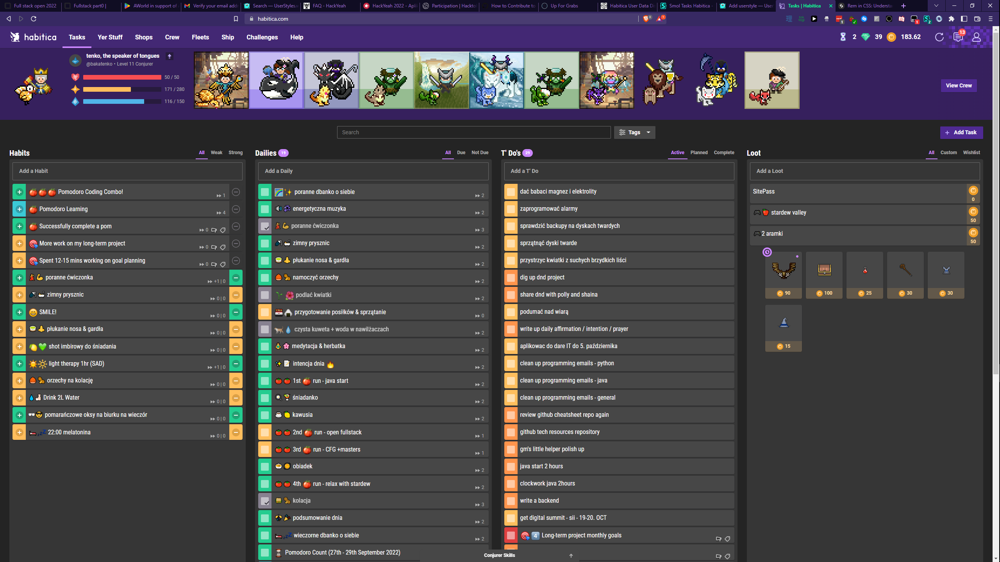

# Smol Habitica

## Description

A user style for [Habitica](https://www.habitica.com) which shrinks the tasks for a more compact global view of all the tasks.

All of the task items are shrinked vertically (only their height is decreased - the text size is not altered). The rewards could not be shrinked as much as the other tasks because I still wanted to have the coin icon displayed 🙂

In the demo photo (which is a screen of my Habitica) I am also using the Habitica recolour called "[Habitica Dark](https://github.com/jeffsieu/habitica-dark)" created by Jeff Sieu, which you can install using [Stylus](https://chrome.google.com/webstore/detail/stylus/clngdbkpkpeebahjckkjfobafhncgmne) just like my style.

## Installation

You can install this user style with Stylus.

**Step #1: get Stylus web browser extension:**

- [Stylus for Chrome](https://chrome.google.com/webstore/detail/stylus/clngdbkpkpeebahjckkjfobafhncgmne)
- [Stylus for Firefox](https://addons.mozilla.org/en-GB/firefox/addon/styl-us)

**Step #2: add this CSS user style to Stylus:**

## Side Notes

The **checklists** and **notes** are set not to show in the global view - you can access them by clicking the task in question. I wanted to make the global view as compact and global as possible (so view as many tasks as possible at the "bird's view" level).

The **due date** in tasks is positioned to the right, close to the challenge & tag icons because it was overlapping with the task title text otherwise. With long task title there still may be some overlap, but this is the extenct how far right this calendar icon & text could have been pushed.
